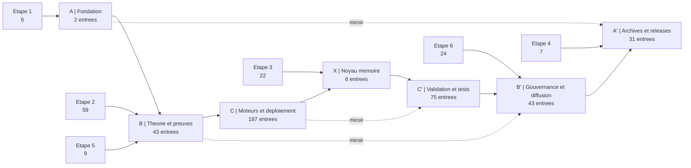

# CARTE VISUELLE ET PLAN CENTRAL DE NAVIGATION

## Carte Mermaid

## Portes D'entree
- A : lire la fondation textuelle et les README chiastiques.
- B : entrer par les preuves, les corpus formels et les PDF constitutionnels/mathematiques.
- C : entrer par les moteurs actifs, APIs, tableaux de bord, deploiement et orchestration.
- X : entrer par la memoire et les JSON reinterpretes.
- C' : entrer par la validation, les tests, le stress et la reproductibilite.
- B' : entrer par les corpus juridiques, prospectus, doctrines et soumissions.
- A' : entrer par les releases, manuscrits souverains et versions augmentees LaTeX/PDF.

## Plan Central
- A | Fondation : `2` entrees
  MDL_Ynor_Framework/README.md
  README.md
- B | Theorie et preuves : `43` entrees
  MDL Ynor Constitution/Chapitre I — Formalisation mathématique intégrale du noyau MDL Ynor.pdf
  MDL Ynor Constitution/MDL Ynor Canonique_/Mdl Ynor — Version Canonique Unifiée V1.pdf
  MDL Ynor Constitution/MDL Ynor MATH/Chapitre I — Formalisation axiomatique minimale.pdf
  MDL Ynor Constitution/MDL Ynor MATH/Chapitre XVI — Formalisation mathématique intégrale du noyau MDL Ynor.pdf
  MDL Ynor Constitution/MDL Ynor — Constitution Structurelle des Systèmes Dissipatifs à Amplification Bornée.pdf
  MDL Ynor Constitution/MDL Ynor — Théorie Structurelle des Systèmes Dissipatifs à Amplification Bornée.pdf
  MDL Ynor Constitution/MDL Ynor — Théorèmes fondamentaux de la marge dissipative.pdf
  MDL Ynor Constitution/MDL Ynor — Traité des dynamiques dissipatives et de la stabilité structurelle.pdf
- C | Moteurs et deploiement : `187` entrees
- X | Noyau memoire : `8` entrees
  MDL_Ynor_Framework/_05_DATA_AND_MEMORY/YNOR_FRACTAL_ULTIMATE_FRAMEWORK.json
  MDL_Ynor_Framework/_05_DATA_AND_MEMORY/hardcore_dataset.json
  MDL_Ynor_Framework/_05_DATA_AND_MEMORY/mdl_global_knowledge.json
  MDL_Ynor_Framework/_05_DATA_AND_MEMORY/mdl_ynor_manifesto_governance.json
  MDL_Ynor_Framework/_05_DATA_AND_MEMORY/obfuscation_mapping_PRIVATE.json
  MDL_Ynor_Framework/_05_DATA_AND_MEMORY/server_pids.json
  MDL_Ynor_Framework/_05_DATA_AND_MEMORY/ynor_unified_prompts.json
  MDL_Ynor_Framework/mdl_intelligence_report.json
- C' | Validation et tests : `75` entrees
- B' | Gouvernance et diffusion : `43` entrees
  MDL Ynor Constitution/MDL — Argent & Juridique/MDL_Charte_Foi_Officielle.pdf
  MDL Ynor Constitution/MDL — Argent & Juridique/MDL_Legal_Pack/Corpus_MDL_2026_VERSION_ULTRA_TECHNIQUE_OPERATIONNELLE(1).pdf
  MDL Ynor Constitution/MDL — Argent & Juridique/MDL_Legal_Pack/Corpus_MDL_2026_VERSION_ULTRA_TECHNIQUE_OPERATIONNELLE.pdf
  MDL Ynor Constitution/MDL — Argent & Juridique/MDL_Legal_Pack/Corpus_MDL_Depot_2026.pdf
  MDL Ynor Constitution/MDL — Argent & Juridique/MDL_Legal_Pack/Corpus_MDL_Depot_2026_VERSION_10_10_HISTORIQUE.pdf
  MDL Ynor Constitution/MDL — Argent & Juridique/MDL_Legal_Pack/Corpus_MDL_Depot_2026_VERSION_CONSTITUTIONNELLE_9_5.pdf
  MDL Ynor Constitution/MDL — Argent & Juridique/MDL_Legal_Pack/Corpus_MDL_Depot_2026_VERSION_ETENDUE_COMPLETE.pdf
  MDL Ynor Constitution/MDL — Argent & Juridique/MDL_Legal_Pack/Corpus_MDL_Depot_2026_VERSION_ULTIME_9_10.pdf
- A' | Archives et releases : `31` entrees
  _RELEASES/GOLDEN_MASTER_PHASE_III/PHASE_IV_ACCESS_CARD.md
  _RELEASES/GOLDEN_MASTER_PHASE_III/PHASE_IV_ACCESS_CARD.tex
  _RELEASES/GOLDEN_MASTER_PHASE_III/SOVEREIGN_GOVERNANCE_CERTIFICATION.md
  _RELEASES/GOLDEN_MASTER_PHASE_III/SOVEREIGN_MASTER_PROMPT_V3.txt
  _RELEASES/GOLDEN_MASTER_PHASE_III/SOVEREIGN_SUCCESS_CERTIFICATE.md
  _RELEASES/GOLDEN_MASTER_PHASE_III/SOVEREIGN_ULTIMATE_KNOWLEDGE_PROMPT_COPY_ME.txt
  _RELEASES/GOLDEN_MASTER_PHASE_III/SUBMISSION_CHECKLIST_SOVEREIGN.md
  _RELEASES/GOLDEN_MASTER_PHASE_III/Sovereign_Global_Knowledge.json

## Centre
Le centre chiastique de la navigation est le passage d'une source a son miroir, puis a sa branche complementaire dans l'axe A -> B -> C -> X -> C' -> B' -> A'.
