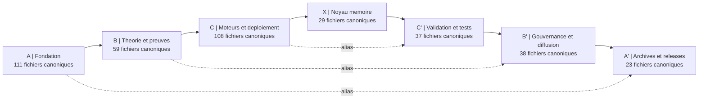

# CARTE VISUELLE ET PLAN CENTRAL DE NAVIGATION

## Carte Canonique

## Lecture
- La carte decrit la vue canonique consolidee du depot.
- Les fichiers derives, miroirs textuels, releases et archives techniques sont hors lecture principale.
- Le centre chiastique reste `X`, mais la navigation doit toujours commencer par la couche canonique et non par le bruit brut.

## Repartition Par Couche
- `01_A_FONDATION` : `111`
- `02_B_THEORIE_ET_PREUVES` : `59`
- `03_C_MOTEURS_ET_DEPLOIEMENT` : `108`
- `04_X_NOYAU_MEMOIRE` : `29`
- `05_C_PRIME_VALIDATION_ET_TESTS` : `37`
- `06_B_PRIME_GOUVERNANCE_ET_DIFFUSION` : `38`
- `07_A_PRIME_ARCHIVES_ET_RELEASES` : `23`

## Totaux
- Depot scanne : `1828` fichiers
- Vue canonique : `509` fichiers
- Collapse : `1319` fichiers
- Taux de collapse : `72.2 %`

## Point De Regle
La carte organise la lecture; elle ne remplace ni la validation externe ni l'audit documentaire.
