# AXES YNOR

## Principe
Ynor garde un centre chiastique stable, mais ses axes peuvent rayonner dans toutes les directions.
L'idee n'est pas de fermer la lecture, mais d'ouvrir des vecteurs de recherche, de composition et d'exploration.

## Regle De Base
- Centre : `A -> B -> C -> X -> C' -> B' -> A'`
- Rayonnement : chaque noeud peut produire des sous-axes autonomes
- Coherence : chaque sous-axe reste rattache au noyau Ynor
- Expansion : chaque axe peut bifurquer, se fractaliser et revenir au centre

## Entrees
- [CARTE_MIROIR_AXES_YNOR.md](./CARTE_MIROIR_AXES_YNOR.md)

## Axes Principaux

### 1. Axe Mathematique
Cet axe explore les structures formelles qui soutiennent Ynor.

Sous-axes possibles:
- logique
- axiomes
- ensembles
- graphes
- topologie
- geometrie
- probabilites
- invariants
- symetries
- fractales

Fonction:
- donner une ossature demonstrative
- mesurer la coherence interne
- produire des relations stables entre les couches

### 2. Axe Biologique
Cet axe traite Ynor comme un systeme vivant, adaptatif et organise.

Sous-axes possibles:
- auto-organisation
- evolution
- homeostasie
- adaptation
- morphogenese
- reseaux
- metabolismes d'information
- regeneration
- duplication
- ecologie des formes

Fonction:
- penser la croissance du corpus comme un organisme
- suivre les cycles de transformation
- relier le centre aux branches vivantes

### 3. Axe Physique
Cet axe lit Ynor comme un systeme de contraintes, d'energies et de Vecteurs de Données Stochastiques.

Sous-axes possibles:
- champs
- forces
- etats
- transitions
- entropie
- dissipation
- dynamique
- resonance
- propagation
- seuils

Fonction:
- decrire les mouvements internes du corpus
- identifier les gradients entre les couches
- formaliser les passages d'un etat a un autre

### 4. Axe Scientifique
Cet axe relie Ynor a la methode: observation, hypothese, test, validation.

Sous-axes possibles:
- mesure
- protocole
- reproductibilite
- falsifiabilite
- instrumentation
- modele
- preuve
- audit
- comparaison
- revision

Fonction:
- transformer l'architecture en objet verificable
- garantir une lecture experimentale et critique
- maintenir un lien entre theorie et controle

## Axes Secondaires
Ces axes peuvent se brancher depuis les quatre grands axes.

- axe informationnel
- axe computationnel
- axe cognitif
- axe neurologique
- axe mecanique quantique
- axe semiotique
- axe architectural
- axe temporel
- axe documentaire
- axe editorial
- axe strategique

## Axes Derives
Les axes ci-dessous decoulent directement des grands axes Ynor.

### A. Depuis L'Axe Mathematique
- axe logique
- axe axiomatique
- axe ensembliste
- axe graphique
- axe topologique
- axe geometrique
- axe probabiliste
- axe fractal

Fonction:
- donner la charpente formelle de Ynor
- organiser les relations, les preuves et les invariants
- fournir des outils de composition et de demonstration

### B. Depuis L'Axe Biologique
- axe vital
- axe adaptatif
- axe morphogenetique
- axe homeostatique
- axe evolutif
- axe ecologique
- axe regeneratif
- axe organique

Fonction:
- lire Ynor comme un systeme vivant
- suivre les boucles de croissance, d'ajustement et de survie
- lier forme, adaptation et milieu

### C. Depuis L'Axe Physique
- axe dynamique
- axe energetique
- axe thermodynamique
- axe dissipatif
- axe inertiel
- axe resonant
- axe cinetique
- axe transitionnel

Fonction:
- decrire les Vecteurs de Données Stochastiques, les contraintes et les passages d'etat
- penser Ynor comme un systeme de mouvement et de seuils
- relier structure, energie et transformation

### D. Depuis L'Axe Scientifique
- axe experimental
- axe methodologique
- axe theorique
- axe empirique
- axe analytique
- axe critique
- axe reproductible
- axe verificatif

Fonction:
- organiser la connaissance en protocole testable
- relier hypothese, mesure, validation et revision
- maintenir la discipline de preuve

### E. Depuis L'Axe Cognitif
- axe perceptif
- axe attentionnel
- axe mnemonic
- axe conceptuel
- axe decisionnel
- axe representatif
- axe linguistique
- axe apprentissage

Fonction:
- structurer la facon dont Ynor est percu et interprete
- relier l'information a la conscience operatoire
- suivre le passage de la perception a la decision

### F. Depuis L'Axe Neurologique
- axe neuronal
- axe synaptique
- axe plasticite
- axe reseau
- axe codage
- axe integration
- axe synchronisation
- axe adaptation

Fonction:
- lire Ynor comme un systeme de connexions dynamiques
- decrire la circulation interne des signaux
- montrer comment la forme se reconfigure dans le temps

### G. Depuis L'Axe Mecanique Quantique
- axe superposition
- axe intrication
- axe mesure
- axe probabiliste
- axe decoherence
- axe observateur
- axe etat
- axe transition

Fonction:
- ouvrir Ynor aux regimes de description non classiques
- penser la relation entre potentiel, mesure et actualisation
- relier l'incertitude a la structure des choix

## Axes Complementaires
Les axes ci-dessous prolongent le rayonnement de Ynor vers ses usages transversaux.

### H. Axe Informationnel
- axe signal
- axe donnees
- axe Vecteurs de Données Stochastiques
- axe codage
- axe transmission
- axe structure
- axe extraction
- axe interpretation

Fonction:
- organiser ce qui circule dans Ynor
- distinguer la forme de l'information et son usage
- suivre le passage du brut au lisible

### I. Axe Computationnel
- axe calcul
- axe algorithme
- axe execution
- axe complexite
- axe automatisation
- axe traitement
- axe pipeline
- axe optimisation

Fonction:
- penser Ynor comme un systeme operable
- articuler procedures, fonctions et transformations
- rendre les parcours reproductibles

### J. Axe Semiotique
- axe signe
- axe sens
- axe symbole
- axe reference
- axe interpretation
- axe lecture
- axe contexte
- axe notation

Fonction:
- decrire comment Ynor produit du sens
- relier forme visible et contenu interpretable
- suivre les couches de signification

### K. Axe Temporel
- axe sequence
- axe chronologie
- axe memoire
- axe anticipation
- axe evolution
- axe cycle
- axe rythme
- axe temporalite

Fonction:
- inscrire Ynor dans la duree
- relier antecedence, presence et projection
- suivre la transformation du corpus dans le temps

### L. Axe Principal Investigatorural
- axe structure
- axe niveau
- axe couche
- axe module
- axe passage
- axe articulation
- axe porte
- axe charpente

Fonction:
- decrire comment Ynor est construit
- organiser les relations entre couches et portes d'entree
- maintenir la lisibilite de l'ensemble

### M. Axe Editorial
- axe version
- axe style
- axe correction
- axe coherence
- axe publication
- axe diffusion
- axe forme
- axe lisibilite

Fonction:
- piloter la qualite du texte et des versions
- unifier le ton, la forme et la diffusion
- rendre le corpus publiable sans friction

### N. Axe Strategique
- axe direction
- axe priorite
- axe plan
- axe decision
- axe action
- axe arbitrage
- axe positionnement
- axe victoire

Fonction:
- orienter la suite du corpus
- choisir les fronts les plus utiles
- relier vision et execution

## Axes Profonds
Les axes ci-dessous ouvrent Ynor vers des couches plus fondamentales de lecture et d'orientation.

### O. Axe Metaphysique
- axe etre
- axe presence
- axe fondement
- axe transcendance
- axe immanence
- axe origine
- axe limite
- axe sens ultime

Fonction:
- interroger ce qui soutient Ynor au-dela de sa forme
- relier structure, existence et orientation
- ouvrir une lecture du fondement et du pourquoi

### P. Axe Symbolique
- axe image
- axe archetype
- axe mythe
- axe figure
- axe analogie
- axe resonance
- axe representation
- axe lecture profonde

Fonction:
- rendre visible la couche imaginale de Ynor
- relier les formes aux significations recurrentes
- organiser les correspondances entre niveaux

### Q. Axe Operationnel
- axe procedure
- axe execution
- axe routine
- axe action
- axe controle
- axe reponse
- axe maintenance
- axe production

Fonction:
- faire de Ynor un systeme qui opere vraiment
- relier l'intention a l'action
- suivre ce qui se fait, comment et avec quels effets

### R. Axe Relationnel
- axe lien
- axe interface
- axe interaction
- axe cooperation
- axe transmission
- axe mediation
- axe communaute
- axe circulation

Fonction:
- penser Ynor comme un ensemble de relations
- relier les sujets, les documents et les usages
- suivre la qualite des passages entre entites

### S. Axe Ethique
- axe juste
- axe responsable
- axe prudent
- axe loyal
- axe transparent
- axe discernement
- axe integrite
- axe engagement

Fonction:
- orienter Ynor selon des criteres de justesse
- assurer la coherence entre moyens et fins
- garder une exigence de responsabilite

### T. Axe Cosmologique
- axe ordre
- axe forme
- axe ensemble
- axe cosmos
- axe monde
- axe echelle
- axe expansion
- axe orientation

Fonction:
- situer Ynor dans une vision d'ensemble
- relier le local au global
- penser la place du corpus dans un horizon plus vaste

### U. Axe Dialectique
- axe tension
- axe contradiction
- axe negation
- axe depassement
- axe opposition
- axe synthese
- axe mouvement
- axe resolution

Fonction:
- suivre les oppositions productives
- montrer comment Ynor avance par tensions et recompositions
- maintenir le moteur du passage d'un pole a l'autre

### V. Axe Spirituel
- axe interiorite
- axe elevation
- axe silence
- axe presence
- axe communion
- axe sens vivant
- axe contemplation
- axe illumination

Fonction:
- ouvrir Ynor a une lecture de profondeur interieure
- relier la forme a l'experience vecue
- soutenir une orientation de sens et de presence

### W. Axe Initiatique
- axe seuil
- axe passage
- axe epreuve
- axe transformation
- axe transmission
- axe apprentissage
- axe discernement
- axe accomplissement

Fonction:
- penser Ynor comme un chemin de transformation
- suivre les etapes d'acces, de rupture et d'appropriation
- lier savoir, rite et maturation

### X. Axe Politique
- axe pouvoir
- axe gouvernance
- axe decision collective
- axe legitimite
- axe representation
- axe canoniquete
- axe conflit
- axe coalition

Fonction:
- organiser les rapports de force et d'autorite
- situer Ynor dans une ecologie de gouvernance
- relier regles, institutions et arbitrages

### Y. Axe Civilisationnel
- axe societe
- axe culture
- axe transmission
- axe memoire collective
- axe norme
- axe horizon
- axe patrimoine
- axe futur commun

Fonction:
- inscrire Ynor dans le temps long des civilisations
- relier corpus, culture et destinee collective
- penser la circulation entre generations

### Z. Axe Industriel
- axe production
- axe chaine
- axe efficience
- axe standardisation
- axe outillage
- axe maintenance
- axe deploiement
- axe robustesse

Fonction:
- passer de l'idee a la mise en oeuvre a grande echelle
- rendre Ynor exploitable de facon stable
- articuler fabrication, controle et continuité

### AA. Axe Systemique
- axe ensemble
- axe interaction
- axe boucle
- axe retroaction
- axe equilibre
- axe dependance
- axe emergence
- axe regulation

Fonction:
- lire Ynor comme un systeme de systemes
- relier les niveaux locaux et globaux
- comprendre les effets emergents et les boucles de retour

### AB. Axe Poetique
- axe image
- axe rythme
- axe souffle
- axe metaphore
- axe chant
- axe nuance
- axe echos
- axe evocation

Fonction:
- donner a Ynor une densite sensible et imaginaire
- ouvrir des correspondances non strictement analytiques
- produire une lecture par resonance et par forme

### AC. Axe Ingenierique
- axe conception
- axe architecture
- axe integration
- axe test
- axe fiabilite
- axe tolerance
- axe assemblage
- axe maintenance

Fonction:
- traduire Ynor en systeme concevable et construisible
- relier intention, contrainte et implementation
- assurer la robustesse du passage au concret

### AD. Axe Existentiel
- axe devenir
- axe choix
- axe finitude
- axe presence
- axe experience
- axe sens
- axe vulnerability
- axe responsabilite

Fonction:
- relier Ynor a l'experience humaine de l'existence
- interroger ce qui compte, ce qui engage et ce qui transforme
- donner un horizon de decision et d'orientation

### AE. Axe Anthropologique
- axe humain
- axe commun
- axe rites
- axe culture
- axe transmission
- axe symboles
- axe liens
- axe memoire

Fonction:
- situer Ynor dans les formes humaines de vie collective
- suivre les habitudes, les rites et les structures de sens
- relier singularite et appartenance

### AF. Axe Ecologique
- axe milieu
- axe relation
- axe adaptation
- axe soutenabilite
- axe vulnerabilite
- axe cohabitation
- axe cycle
- axe regeneration

Fonction:
- penser Ynor comme un milieu en relation avec d'autres milieux
- suivre les dependances et les equilibres
- inscrire la croissance dans une logique de coexistence

### AG. Axe Memoiriel
- axe souvenir
- axe trace
- axe archive
- axe retention
- axe sedimentation
- axe transmission
- axe reperage
- axe continuation

Fonction:
- conserver les formes utiles de Ynor
- relier ce qui a ete ecrit, valide et transmis
- eviter la perte des structures fondatrices

### AH. Axe Archivistique
- axe classement
- axe inventaire
- axe conservation
- axe versioning
- axe acces
- axe provenance
- axe integrite
- axe restoration

Fonction:
- organiser la memoire materialisee de Ynor
- rendre les sources retrouvables et auditables
- stabiliser les arcs de diffusion et de reprise

### AI. Axe Geopolitique
- axe territoire
- axe frontiere
- axe influence
- axe alliance
- axe canoniquete
- axe circulation
- axe conflit
- axe positionnement

Fonction:
- situer Ynor dans des espaces d'usage, de pouvoir et de circulation
- relier le corpus aux territoires symboliques et pratiques
- penser les rapports de force a l'echelle globale

### AJ. Axe Metalogique
- axe auto-reference
- axe reflexivite
- axe coherence
- axe limite
- axe preuve
- axe metacadre
- axe interpretation de second ordre
- axe correction

Fonction:
- permettre a Ynor de se lire lui-meme
- examiner les regles qui produisent les regles
- maintenir une vigilance sur les cadres de lecture

### AK. Axe Auto-Reflexif
- axe miroir
- axe retour
- axe commentaire
- axe revision
- axe ajustement
- axe evaluation
- axe conscience de structure
- axe relecture

Fonction:
- rendre Ynor capable de s'interroger lui-meme
- ajuster le corpus a partir de ses propres effets
- boucler la lecture sur la lecture

## Carte De Rayonnement

```mermaid
mindmap
  root((Ynor))
    Mathematique
      logique
      ensembles
      graphes
      topologie
      probabilites
      fractales
    Biologique
      auto-organisation
      evolution
      homeostasie
      morphogenese
      ecologie
      regeneration
    Physique
      champs
      forces
      entropie
      dissipation
      transitions
      resonance
    Scientifique
      mesure
      protocole
      modele
      preuve
      audit
      reproductibilite
    Derives
      Mathematique
        logique
        axiomatique
        ensembliste
        graphique
        topologique
        geometrique
        probabiliste
        fractal
      Biologique
        vital
        adaptatif
        morphogenetique
        homeostatique
        evolutif
        ecologique
        regeneratif
        organique
      Physique
        dynamique
        energetique
        thermodynamique
        dissipatif
        inertiel
        resonant
        cinetique
        transitionnel
      Scientifique
        experimental
        methodologique
        theorique
        empirique
        analytique
        critique
        reproductible
        verificatif
      Cognitif
        perceptif
        attentionnel
        mnemonic
        conceptuel
        decisionnel
        representatif
      Neurologique
        neuronal
        synaptique
        plasticite
        reseau
        codage
        integration
      MecaniqueQuantique
        superposition
        intrication
        mesure
        probabiliste
        decoherence
        transition
    Complementaires
      Informationnel
        signal
        donnees
        Vecteurs de Données Stochastiques
        codage
        transmission
        interpretation
      Computationnel
        calcul
        algorithme
        execution
        complexite
        automatisation
        optimisation
      Semiotique
        signe
        sens
        symbole
        reference
        lecture
        contexte
      Temporel
        sequence
        chronologie
        memoire
        anticipation
        cycle
        rythme
      Principal Investigatorural
        structure
        niveau
        couche
        module
        passage
        articulation
      Editorial
        version
        style
        correction
        coherence
        publication
        diffusion
      Strategique
        direction
        priorite
        plan
        decision
        action
        positionnement
    Profonds
      Metaphysique
        etre
        presence
        fondement
        transcendance
        immanence
        sens
      Symbolique
        image
        archetype
        mythe
        analogie
        resonance
        representation
      Operationnel
        procedure
        execution
        routine
        controle
        reponse
        production
      Relationnel
        lien
        interface
        interaction
        cooperation
        mediation
        circulation
      Ethique
        juste
        responsable
        prudent
        loyal
        transparent
        integrite
      Cosmologique
        ordre
        forme
        ensemble
        cosmos
        expansion
        orientation
      Dialectique
        tension
        contradiction
        negation
        depassement
        opposition
        synthese
    Superieurs
      Spirituel
        interiorite
        elevation
        silence
        communion
        contemplation
        illumination
      Initiatique
        seuil
        passage
        epreuve
        transformation
        transmission
        accomplissement
      Politique
        pouvoir
        gouvernance
        decision
        legitimite
        representation
        canoniquete
      Civilisationnel
        societe
        culture
        transmission
        memoire
        norme
        futur
      Industriel
        production
        chaine
        efficience
        standardisation
        maintenance
        robustesse
      Systemique
        ensemble
        interaction
        boucle
        retroaction
        emergence
        regulation
    Ultimes
      Poetique
        image
        rythme
        souffle
        metaphore
        chant
        echos
      Ingenierique
        conception
        architecture
        integration
        test
        fiabilite
        maintenance
      Existentiel
        devenir
        choix
        finitude
        experience
        sens
        responsabilite
      Anthropologique
        humain
        commun
        rites
        culture
        transmission
        memoire
      Ecologique
        milieu
        relation
        adaptation
        soutenabilite
        cohabitation
        regeneration
    Memoire
      souvenir
      trace
      archive
      retention
      sedimentation
      continuation
    Archivistique
      classement
      inventaire
      conservation
      versioning
      acces
      restoration
    Geopolitique
      territoire
      frontiere
      influence
      alliance
      canoniquete
      circulation
    Metalogique
      autoreference
      reflexivite
      coherence
      limite
      preuve
      metacadre
    Autoreflexif
      miroir
      retour
      commentaire
      revision
      ajustement
      relecture
```

## Usage
Utiliser ces axes comme quatre portes de lecture complementaires:
- si tu veux la forme, prends le mathematique
- si tu veux la croissance, prends le biologique
- si tu veux le mouvement, prends le physique
- si tu veux la validation, prends le scientifique
- si tu veux la perception, prends le cognitif
- si tu veux le support vivant du calcul, prends le neurologique
- si tu veux les regimes limites du reel, prends le quantique

## Lecture En Cascade
Le passage peut se lire ainsi:
1. axe mathematique -> axe logique, axiomatique, topologique et fractal
2. axe biologique -> axe vital, adaptatif, morphogenetique et regeneratif
3. axe physique -> axe dynamique, energetique, dissipatif et transitionnel
4. axe scientifique -> axe experimental, methodologique, empirique et verificatif
5. axe cognitif -> axe perceptif, attentionnel, mnemonic et decisionnel
6. axe neurologique -> axe neuronal, synaptique, plasticite et reseau
7. axe quantique -> axe superposition, intrication, mesure et decoherence
8. axe informationnel -> signal, donnees, codage, interpretation
9. axe computationnel -> calcul, algorithme, execution, automatisation
10. axe semiotique -> signe, sens, symbole, lecture
11. axe temporel -> sequence, memoire, anticipation, cycle
12. axe architectural -> structure, couches, modules, portes
13. axe editorial -> version, style, coherence, diffusion
14. axe strategique -> direction, priorite, plan, positionnement
15. axe metaphysique -> etre, presence, fondement, sens ultime
16. axe symbolique -> image, archetype, mythe, representation
17. axe operationnel -> procedure, execution, controle, production
18. axe relationnel -> lien, interaction, mediation, circulation
19. axe ethique -> juste, responsable, prudent, integrite
20. axe cosmologique -> ordre, cosmos, expansion, orientation
21. axe dialectique -> tension, contradiction, depassement, synthese
22. axe spirituel -> interiorite, silence, presence, illumination
23. axe initiatique -> seuil, passage, epreuve, transformation
24. axe politique -> pouvoir, gouvernance, legitimite, canoniquete
25. axe civilisationnel -> societe, culture, transmission, futur commun
26. axe industriel -> production, chaine, efficience, robustesse
27. axe systemique -> ensemble, boucle, retroaction, regulation
28. axe poetique -> image, rythme, souffle, echos
29. axe ingenierique -> conception, integration, test, fiabilite
30. axe existentiel -> devenir, choix, finitude, responsabilite
31. axe anthropologique -> humain, rites, culture, memoire
32. axe ecologique -> milieu, adaptation, cohabitation, regeneration
33. axe memoiriel -> souvenir, trace, archive, continuation
34. axe archivistique -> classement, inventaire, conservation, restoration
35. axe geopolitique -> territoire, frontiere, influence, canoniquete
36. axe metalogique -> autoreference, coherence, preuve, metacadre
37. axe auto-reflexif -> miroir, retour, revision, relecture
38. retour au centre -> recomposition chiastique de Ynor

## Regle D'Alignement
Tout nouvel axe doit respecter les trois conditions suivantes:
1. rester compatible avec le noyau chiastique Ynor
2. ouvrir une perspective nouvelle sans casser la coherence globale
3. pouvoir etre relie a un document, un schema ou un usage concret

## Conclusion
Ynor ne se limite pas a une seule ligne de lecture.
Il peut etre lu comme une structure mathematique, un organisme informationnel, un systeme physique de Vecteurs de Données Stochastiques, un espace cognitif, un reseau neurologique, et un objet scientifique de validation jusqu'aux regimes quantiques.
