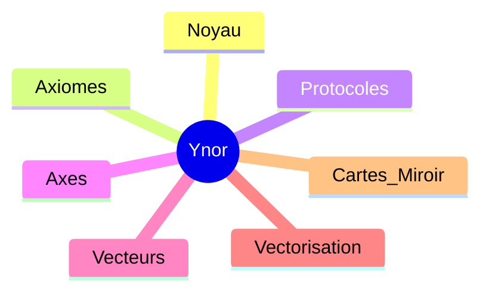

# CARTE CANONIQUE PUBLIQUE YNOR

## Statut
Cette carte propose la synthese la plus compacte du corpus Ynor.
Elle garde le centre visible et resume la structure en une vue publique simple.

## Schema

## Lecture Publique
- Le noyau tient le centre.
- Les axiomes fixent la base.
- Les protocoles fixent le geste.
- Les axes ouvrent le rayonnement.
- Les vecteurs donnent les lignes de force.
- La vectorisation relie les couches.
- Les cartes miroir assurent le retour vers la coherence.

## Usage
Cette version sert de lecture publique courte.
Elle renvoie vers la carte canonique unique pour la vue complete.

