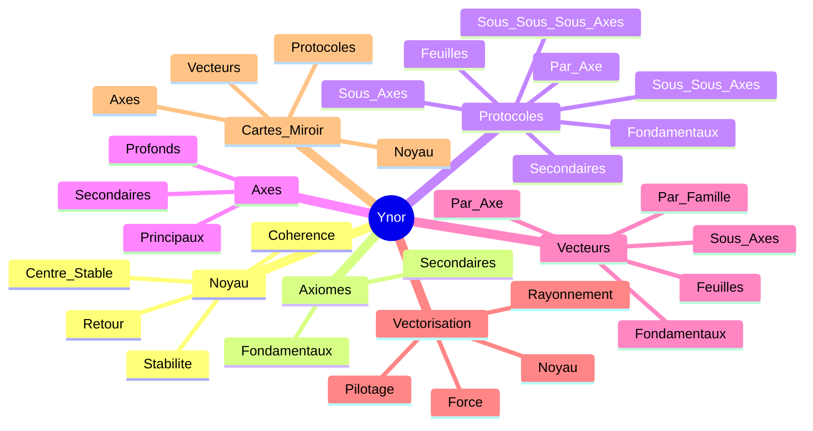

# CARTE CANONIQUE UNIQUE YNOR

## Statut
Cette carte est la vue canonique unique du corpus Ynor.
Elle rassemble le noyau, les axiomes, les protocoles, les axes, les vecteurs et la vectorisation en un seul schema de lecture.

## Carte

## Lecture Canonique
- Le noyau fixe le centre stable.
- Les axiomes fixent la base.
- Les protocoles fixent le geste.
- Les axes fixent le rayonnement.
- Les vecteurs fixent les lignes de force.
- La vectorisation fixe la lecture operationnelle.
- Les cartes miroir fixent le retour vers la coherence.

## Usage
Cette carte sert de reference canonique pour naviguer dans tout le corpus Ynor.
Elle peut remplacer toute lecture partielle quand on veut une vision unique, compacte et complete.

