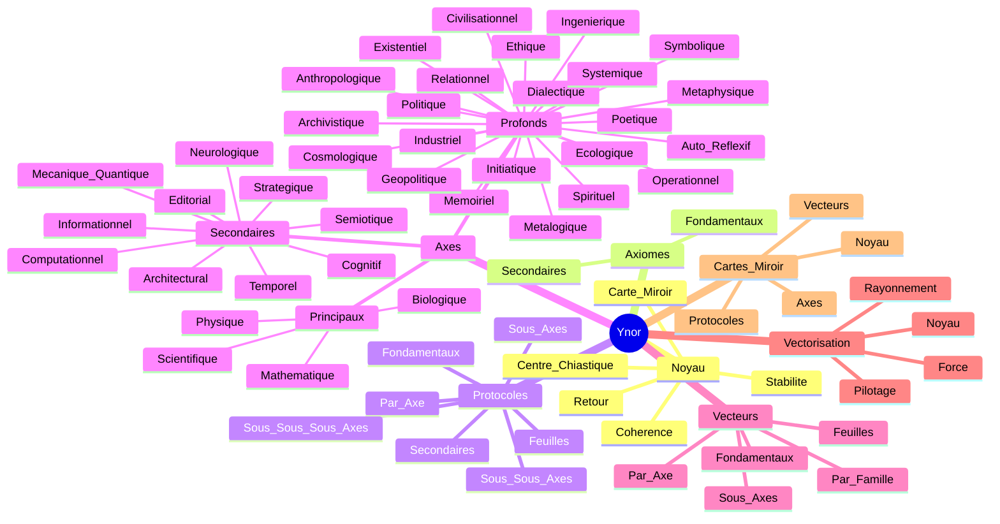

# CARTE MERMAID GLOBALE YNOR

## Statut
Cette carte rassemble la structure Ynor en une vue unique et lisible.
Elle relie les axiomes, les protocoles, les axes, les vecteurs et la vectorisation.

## Carte

## Lecture
- Le noyau tient le centre.
- La carte miroir du noyau relie le centre a la loi et au geste.
- Les axiomes fixent la base.
- Les protocoles fixent le geste.
- Les axes fixent le rayonnement.
- Les vecteurs fixent les lignes de force.
- La vectorisation fixe la lecture unique qui relie tout.

## Usage
Cette carte sert de vue rapide pour naviguer dans tout le corpus Ynor.
Elle peut aussi servir de socle pour une version visuelle plus detaillee.
