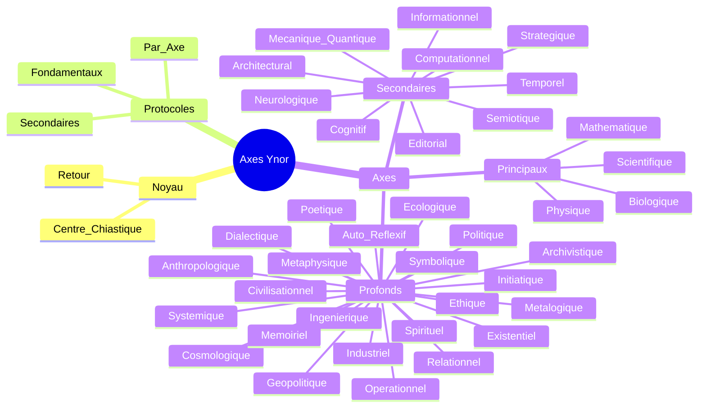

# CARTE MIROIR AXES YNOR

## Statut
Cette carte relie le noyau Ynor a la couche des axes.
Elle montre comment le centre se decline en rayonnement et revient vers la coherence.

## Carte

## Lecture
- Le noyau fixe le centre.
- Les protocoles fixent le geste.
- Les axes ouvrent le rayonnement.
- Les axes profonds prolongent la lecture dans la densite.
- Le retour garde la coherence du systeme.

## Usage
Cette carte sert a lire la couche des axes comme prolongement radial du noyau Ynor.
Elle peut servir de sous-carte de reference pour toute lecture de rayonnement.
