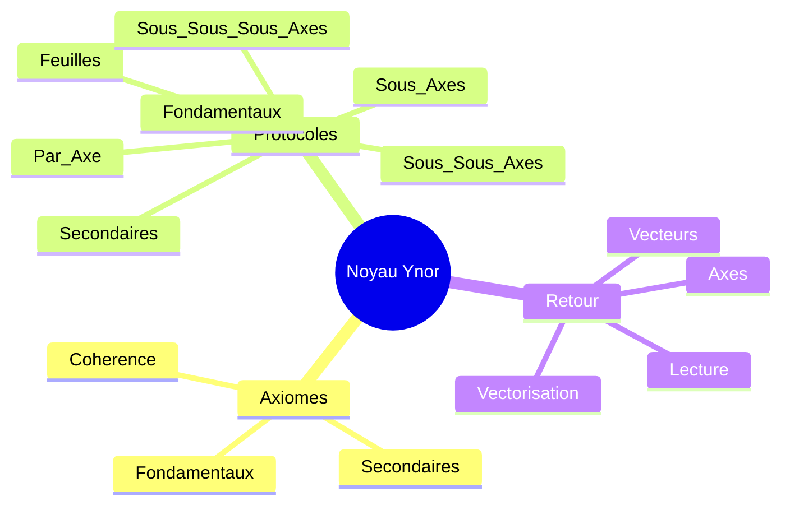

# CARTE MIROIR NOYAU YNOR

## Statut
Cette carte relie le noyau Ynor aux axiomes et aux protocoles.
Elle montre comment le centre se traduit en loi, en geste et en retour vers la coherence.

## Carte

## Lecture
- Le noyau fixe le centre.
- Les axiomes fixent la loi.
- Les protocoles fixent les gestes.
- Le retour fixe la boucle de coherence.

## Usage
Cette carte sert a lire le noyau comme point de jonction entre la base axiologique et la pratique protocolaire.
Elle peut servir de sous-carte de reference pour toute lecture centrale du corpus Ynor.
