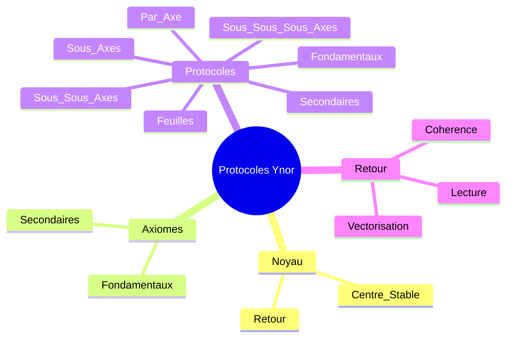

# CARTE MIROIR PROTOCOLES YNOR

## Statut
Cette carte relie le noyau Ynor a la couche des protocoles.
Elle montre comment le centre se traduit en geste, en controle et en retour vers la coherence.

## Carte

## Lecture
- Le noyau fixe le centre.
- Les axiomes fixent la loi.
- Les protocoles fixent les gestes.
- Le retour fixe la coherence.

## Usage
Cette carte sert a lire la couche protocolaire comme prolongement direct du noyau Ynor.
Elle peut servir de sous-carte de reference pour toute lecture de travail et de controle.
