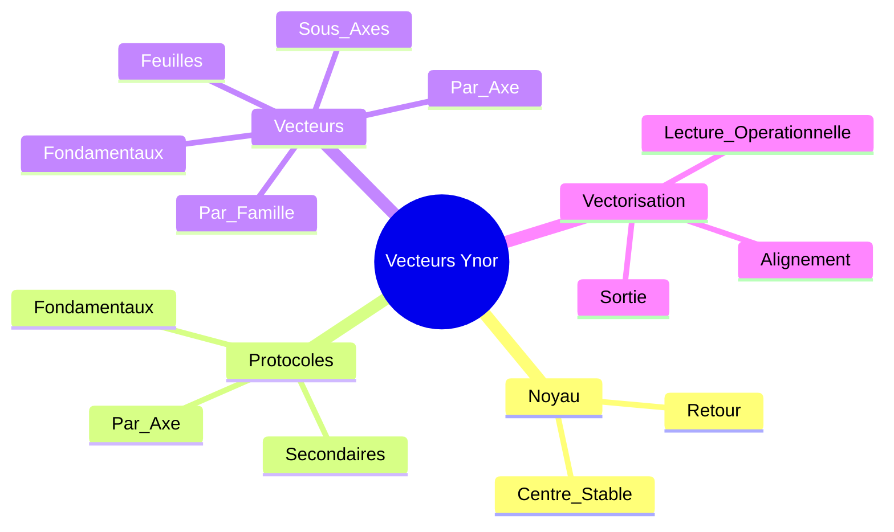

# CARTE MIROIR VECTEURS YNOR

## Statut
Cette carte relie le noyau Ynor a la couche des vecteurs.
Elle montre comment le centre se traduit en lignes de force et revient vers la coherence.

## Carte

## Lecture
- Le noyau donne l'origine.
- Les protocoles donnent le geste.
- Les vecteurs donnent les lignes de force.
- La vectorisation donne la lecture operationnelle.
- Le retour fixe la coherence du mouvement.

## Usage
Cette carte sert a lire la couche vectorielle comme prolongement direct du noyau Ynor.
Elle peut servir de sous-carte de reference pour toute lecture de force et de passage.
